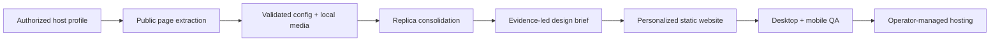

# Airbnb Profile to Website Generator

**Turn one authorized Airbnb host profile into a complete, personalized
hospitality website.**

Airbnb Profile to Website Generator discovers a host's public listings,
extracts structured property data and owned photography, detects duplicate
listings for the same physical stay, derives an evidence-led design direction,
and produces a responsive static website ready for review.

> One profile URL in. Structured portfolio data, local media, a design brief,
> and a three-file website out.

[](https://github.com/xzaviourr/airbnb-profile-website-generator/actions/workflows/ci.yml)
[](https://nodejs.org/)
[](https://www.typescriptlang.org/)
[](./LICENSE)

## Why this project?

Many excellent hosts manage several properties but have no independent
portfolio website. Their identity is spread across listing pages, making it
hard to present the collection as an established hospitality brand.

This project turns that fragmented profile into a portable, owner-focused web
presence while keeping facts, images, reviews, amenities, and booking links
attached to the correct property.

## Highlights

- **One-profile workflow** — discover and process every public listing from a
  host URL.
- **Structured, validated data** — Zod-backed `site-config.json` with host,
  property, amenity, rating, rule, location, and media data.
- **Property-only galleries** — reject avatars, map tiles, platform assets,
  recommendation thumbnails, unrelated listings, and resized duplicates.
- **Replica consolidation** — detect multiple listing records for one physical
  stay using strong shared-photo evidence, without hiding similar but distinct
  units.
- **Evidence-led design** — derive audience, voice, archetype, palette, content
  structure, and image direction from the actual portfolio.
- **Personalized static website** — framework-free HTML, CSS, and JavaScript
  with responsive routes, galleries, host story, comparison, and exact booking
  links.
- **First-party owner voice** — no extraction jargon or visitor-facing copy
  that makes the website feel converted from another platform.
- **Review-before-publish lifecycle** — complete local QA before handing the
  generated package to an operator-managed hosting workflow.

## How it works



The extractor is deterministic TypeScript. The repository-level Copilot skill
orchestrates the complete extraction-to-website workflow and enforces the
content, design, accessibility, verification, and publication rules.

## Quick start

### Requirements

- Node.js 20 or newer
- Chromium for Playwright
- A public Airbnb host profile
- Authorization from the host to copy and reuse the profile, listing, and
  image content

### Install

```bash
git clone https://github.com/xzaviourr/airbnb-profile-website-generator.git
cd airbnb-profile-website-generator
npm install
npx playwright install chromium
```

### Extract a portfolio

```bash
npm run extract -- \
  "https://www.airbnb.com/users/show/12345678" \
  --acknowledge-site-terms \
  --headless \
  --output ./output/example-stays--host-name
```

The authorization acknowledgment is mandatory. The importer only reads public
pages and stops when a verification or access-control challenge appears.

### Generate the design brief

```bash
npm run theme -- \
  ./output/example-stays--host-name/site-config.json \
  --output ./output/example-stays--host-name/design-brief.json
```

### Generate the complete website with Copilot

Open the repository in VS Code with GitHub Copilot, then ask:

```text
Run the airbnb-website skill for this authorized host profile:
https://www.airbnb.com/users/show/12345678
```

The project skill at
[`airbnb-website`](./.github/skills/airbnb-website/SKILL.md) handles extraction,
auditing, photo-led art direction, website implementation, and desktop/mobile
QA. Generated websites are intentionally ignored by Git.

## Output

```text
output/<brand-slug>--<host-slug>/
  site-config.json
  design-brief.json
  images/
    host/profile.jpg
    properties/<property-slug>/image-001.jpg
  website/
    index.html
    styles.css
    app.js
```

The website has exactly three authored files and uses hash routes, so it works
from local files and ordinary static hosting without rewrite configuration:

```text
#/                         home
#/stays                    all canonical stays
#/stays/<property-id>      property detail
#/contact                  host contact
```

Downloaded host content and generated websites remain under `output/` and are
never committed.

## Data quality and safety

### Property media

Airbnb pages can contain host portraits, reviewer avatars, maps, badges,
recommendations, and multiple resized forms of one photo. This project accepts
listing-owned media, canonicalizes URLs before deduplication, verifies local
files, and preserves download failures as explicit warnings.

### Duplicate listings

`replicaGroups` keeps all source records for traceability while selecting one
canonical public stay. Automatic consolidation requires strong shared-photo
evidence plus corroborating facts. Similar names, locations, capacities, or
amenities alone never trigger a merge.

### Claims and copy

Website facts must map to extracted evidence. Missing details remain missing;
the generator does not invent prices, awards, availability, policies, contact
channels, coordinates, or host credentials.

## Validation

```bash
npm run check
npm test
npm run build
```

The test suite covers URL validation, live-markup parsing fixtures, property
media filtering, replica detection, canonical portfolio selection, and design
brief generation. GitHub Actions runs type checking, tests, builds, Python
syntax checks, and shell syntax checks on every pull request.

## Optional preview host

The `hosting/` directory contains a small Flask/Gunicorn registry that can
serve many generated sites from one process. It supports:

- stable `/preview/<site-slug>/` URLs with a server-injected
  `UNLICENSED SALES PREVIEW` watermark;
- noindex, noarchive, no-store, no-referrer, and frame-blocking headers;
- disabled production routes until an operator marks a package as production.

The repository intentionally excludes remote deployment credentials, SSH
receivers, server service definitions, and upload scripts. Copy approved output
packages to your hosting environment using your own deployment system.

Run the host locally:

```bash
python3 -m venv .venv
. .venv/bin/activate
pip install -r hosting/requirements.txt
export AIRBNB_SITES_ROOT="$PWD/output"
gunicorn --chdir hosting --bind 127.0.0.1:3000 app:app
```

An interactive browser preview cannot prevent visitors from inspecting assets
their browser receives. Watermarking and response headers deter casual copying;
use screenshots or video when runnable frontend assets must not be delivered.

## Responsible use

Use this project only for listings you own, manage, or have written permission
to reuse. Review Airbnb's terms, robots rules, and applicable law before
operation.

The extractor does not sign in, call private APIs, solve CAPTCHAs, rotate
proxies, spoof fingerprints, evade rate limits, or bypass access controls. If a
site blocks access or requests verification, stop rather than circumventing
that control. Prefer an official partner/API integration when one is available
for your use case.

## Contributing

Issues and focused pull requests are welcome. See
[CONTRIBUTING.md](./CONTRIBUTING.md) for development and fixture guidelines.

## License

[MIT](./LICENSE)
